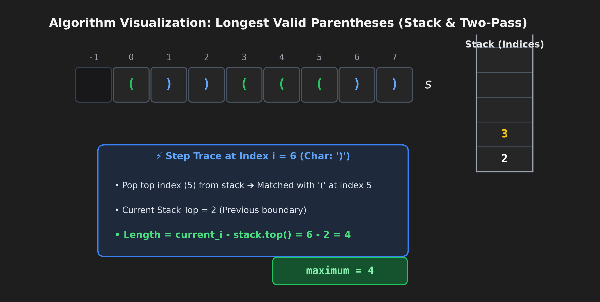

# [32. Longest Valid Parentheses](https://leetcode.com/problems/longest-valid-parentheses/)

**Difficulty:** `Hard` | **Tags:** `String`, `Dynamic Programming`, `Stack` | **Date Solved:** `2026-09-30`

---

## Problem Statement

Given a string containing just the characters `'('` and `')'`, return *the length of the longest valid (well-formed) parentheses substring*.

### Example 1:
```text
Input: s = "(()"
Output: 2
Explanation: The longest valid parentheses substring is "()".
```

### Example 2:
```text
Input: s = ")()())"
Output: 4
Explanation: The longest valid parentheses substring is "()()".
```

### Constraints:
* `0 <= s.length <= 3 * 10^4`
* `s[i]` is `'('`, or `')'`.

---

## 🎨 Algorithm Visualization



---

## Solutions

### 1. C++ (Primary) — 0 ms (Beats 100.00%)
```cpp
class Solution {
public:
    int longestValidParentheses(string s) {
        int left = 0, right = 0, maxLen = 0, n = s.length();
        for (int i = 0; i < n; i++) {
            if (s[i] == '(') left++;
            else right++;
            if (left == right) maxLen = max(maxLen, 2 * right);
            else if (right > left) left = right = 0;
        }
        left = right = 0;
        for (int i = n - 1; i >= 0; i--) {
            if (s[i] == '(') left++;
            else right++;
            if (left == right) maxLen = max(maxLen, 2 * left);
            else if (left > right) left = right = 0;
        }
        return maxLen;
    }
};
```

### 2. Java
```java
class Solution {
    public int longestValidParentheses(String s) {
        int left = 0, right = 0, maxLen = 0, n = s.length();
        for (int i = 0; i < n; i++) {
            if (s.charAt(i) == '(') left++;
            else right++;
            if (left == right) maxLen = Math.max(maxLen, 2 * right);
            else if (right > left) left = right = 0;
        }
        left = right = 0;
        for (int i = n - 1; i >= 0; i--) {
            if (s.charAt(i) == '(') left++;
            else right++;
            if (left == right) maxLen = Math.max(maxLen, 2 * left);
            else if (left > right) left = right = 0;
        }
        return maxLen;
    }
}
```

### 3. Python 3
```python
class Solution:
    def longestValidParentheses(self, s: str) -> int:
        left = right = max_len = 0
        for ch in s:
            if ch == '(':
                left += 1
            else:
                right += 1
            if left == right:
                max_len = max(max_len, 2 * right)
            elif right > left:
                left = right = 0
        
        left = right = 0
        for ch in reversed(s):
            if ch == '(':
                left += 1
            else:
                right += 1
            if left == right:
                max_len = max(max_len, 2 * left)
            elif left > right:
                left = right = 0
                
        return max_len
```

---

## ⏱️ Complexity Analysis
* **Time Complexity:** `O(N)` — Exactly two linear passes ($2N$ operations).
* **Space Complexity:** `O(1)` — Pure auxiliary space using primitive integer counters.
